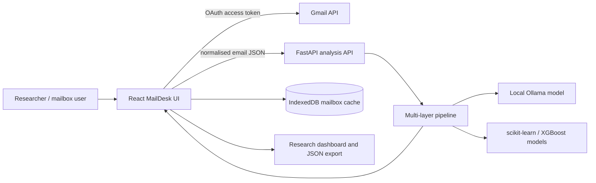
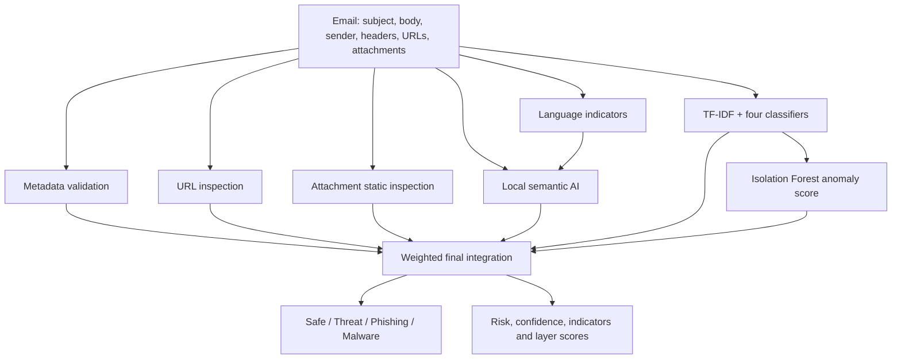

# Architecture and implementation

## Purpose and boundary

MailDesk is a research prototype for detecting and explaining phishing, malware and other malicious email. It connects a Gmail mailbox to an Outlook-inspired React interface and a Python analysis API. Its purpose is to test the proposal's multi-layer design; it is not a production mail gateway, antivirus product or malware sandbox.

## System context



The browser calls Gmail directly using a user-granted OAuth access token. It sends only the fields needed for analysis to the local Python service. Access tokens are held in `sessionStorage`; cached mailbox data and AI results are account/folder/query scoped in IndexedDB.

## Analysis flow



## Input and output

The analysis input in `backend/schemas.py` contains:

- Gmail message ID, sender name/address, recipient, subject and plain-text body;
- a selected header map, including authentication and routing-related headers where Gmail supplies them;
- attachment name, media type, size and an optional base64 sample.

The response contains a suspicious decision, four-class category, confidence, weighted risk score, human-readable reason, ranked indicators, every layer result and per-model risk scores.

## Layer design

### 1. Metadata validation

`metadata_layer` compares sender, Reply-To and Return-Path domains; reads SPF, DKIM and DMARC results; checks punycode sender domains and missing Message-ID. These are static indicators, not absolute proof: forwarding, mailing lists and incomplete headers can produce legitimate anomalies.

### 2. URL inspection

`url_layer` extracts HTTP(S)/`www` links and checks IP-literal hosts, known shorteners, punycode, unusual host construction, sensitive actions over HTTP and mismatch with the sender domain. It does not currently resolve redirects, fetch pages or call a reputation service, which avoids automatic interaction with hostile links.

### 3. Attachment inspection

`attachment_layer` checks risky/archive/double extensions, executable magic bytes and macro/script markers, and calculates SHA-256 for samples supplied by the client. The browser samples only small files and the Python layer never executes them. Password-protected archives, document parsing, YARA, antivirus reputation and sandbox behaviour are pending research extensions.

### 4. Language indicators

`language_indicators` detects urgency, credential requests, payment pressure and forceful presentation. It supplies a transparent lexical score and is also the fallback when the local semantic model is unavailable.

### 5. Semantic generative AI

`backend/ollama_client.py` asks a local `llama3.2:latest` model for a category, risk score and concise reason. Local execution supports a privacy-conscious prototype. Results depend on the exact model, prompt and runtime and must therefore be logged and frozen during experiments.

### 6. Supervised machine learning

`ModelService` fits a TF-IDF unigram/bigram representation and four classifiers:

- Logistic Regression;
- Random Forest;
- encoded-label XGBoost;
- scikit-learn multilayer perceptron (the neural classifier).

Their class probabilities are averaged to form the ML class distribution. The application currently trains at service startup from `data/bootstrap_emails.csv`; production/research hardening should train offline, store a versioned artefact and load it read-only.

### 7. Anomaly detection

Isolation Forest is fitted only on safe bootstrap vectors. Its decision value is transformed into a 0–1 anomaly score. This supports investigation of unusual messages, but it is only a proxy for zero-day detection until tested on deliberately excluded and chronologically unseen campaigns.

### 8. Final integration

The final risk is:

```text
0.30 semantic AI
+ 0.30 machine learning
+ 0.13 metadata
+ 0.10 URLs
+ 0.12 attachments
+ 0.05 anomaly detection
```

The suspicious threshold is `0.48`, with safety overrides for strong attachment/metadata evidence and corroborated ML risk. Category selection augments ML probabilities with evidence appropriate to phishing, malware and generic threats. Constants are exposed by `GET /framework` to keep the experiment auditable.

These weights are engineering defaults. The final study must tune them only on training/validation data and evaluate the locked values on untouched test data.

## Application surfaces

- **Mail:** Gmail folder/search loading, cached analysis, message reading, sending/drafting, Gmail actions, AI scanning and explanations.
- **Account:** Google profile, session restoration, sign out and account switching.
- **Research:** manual ground truth, live confusion matrix, per-class metrics, bootstrap model table, anomaly count and JSON export.

Ground-truth labels persist with the account-scoped mailbox cache. The export is user-initiated and can contain email addresses and subjects, so it must be stored securely and anonymised before publication or sharing.

## API

| Method/path | Purpose |
|---|---|
| `GET /health` | Service readiness and framework version |
| `GET /framework` | Categories, models, layers, weights, threshold and limitations |
| `GET /evaluation` | Saved bootstrap evaluation report |
| `POST /analyze?use_ollama=true` | Full analysis of one normalised email |

Vite proxies browser requests beginning `/api` to the local API on port 8001.

## Operational and ethical controls

- Use dedicated research accounts and non-production data wherever possible.
- Never send live credential-harvesting links or active malware through Gmail.
- Store malware only in an authorised isolated lab; use hashes or harmless EICAR-like fixtures for normal UI testing.
- Remove or hash personal identifiers before building datasets or sharing exports.
- Preserve dataset licences, collection dates, label sources and exclusions.
- Treat model output as decision support; false positives and false negatives require review paths.

## Known limitations

- Synthetic bootstrap training data is too small for scientific claims.
- No attachment sandbox, URL reputation feed, redirect resolution or malware-family classifier.
- No full MIME/HTML/routing/geolocation feature pipeline.
- No offline model artefact registry, probability calibration or drift monitor.
- Local semantic inference may be unavailable and its latency varies by machine.
- Gmail integration demonstrates one environment and does not establish enterprise feasibility.
- No controlled zero-day performance result exists yet.
